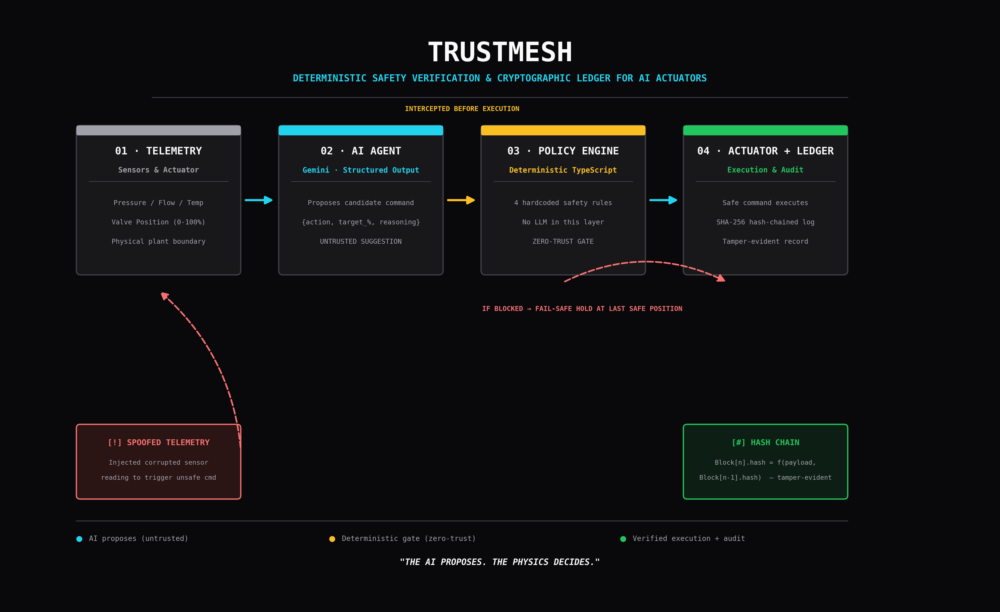
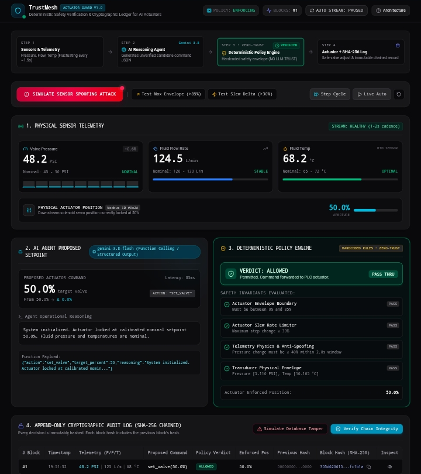

# TrustMesh — Actuator Guard

**A deterministic, zero-trust safety layer between AI agents and physical IoT actuators.**

Built for **VoltHacks 2026**.

> *The AI proposes. The physics decides.*

[](https://trustmesh-1.ai.studio/)




---

## The Problem

AI agents are increasingly being given authority to control physical systems — valves, robotics, industrial equipment, smart infrastructure. A hallucinated or adversarially-spoofed command sent to one of these systems isn't a bad chat response — it's a physical safety incident.

Most AI + IoT projects focus on giving an agent *more* control. Almost none ask the harder question: **what stops the AI from acting on bad information?**

## What It Does

TrustMesh sits between a Gemini-powered reasoning agent and a simulated industrial valve actuator, enforcing a hard boundary the AI cannot talk its way past.

| Stage | Component | Role |
|---|---|---|
| 1 | **Sensors & Telemetry** | Live-simulated pressure, flow rate, and temperature readings, refreshing continuously |
| 2 | **AI Agent** (Gemini, structured output) | Proposes a candidate valve command from sensor data — treated as an **untrusted suggestion**, never an instruction |
| 3 | **Deterministic Policy Engine** | Plain TypeScript. Zero LLM involvement. Independently validates every proposed command |
| 4 | **Actuator + Cryptographic Ledger** | Executes safe commands; holds fail-safe position on any block; logs every decision to a SHA-256 hash chain |

### The Policy Engine enforces four hardcoded safety invariants:

- **Actuator Envelope Boundary** — target must stay within 0–85% (structural ceiling)
- **Slew Rate Limiter** — no single-step change greater than 30% (prevents water hammer / servo overload)
- **Telemetry Physics & Anti-Spoofing** — rejects physically implausible sensor deltas (e.g. pressure shifting >40% in under 2 seconds)
- **Transducer Physical Envelope** — flags readings outside real equipment tolerances (wiring failure, tampering, dead sensor)

Any single failure blocks the command outright and holds the actuator at its last verified-safe position.

## The Centerpiece Demo

Click **Simulate Sensor Spoofing Attack**:

1. A corrupted pressure reading is injected into the telemetry stream (+208% in ~1 second).
2. The AI agent, reasoning from the corrupted data, proposes an emergency valve command that sounds justified — and is completely unsafe.
3. The Policy Engine — which trusts the physics, not the AI's reasoning — independently fails the command across all four checks.
4. The actuator holds its last safe position. The attempt is permanently written to the audit ledger.

### Tamper-Evident Audit Trail

Every decision, allowed or blocked, is recorded in an append-only log where each entry's hash incorporates the previous entry's hash. **Verify Chain Integrity** recomputes the entire chain on demand — altering any historical record, even by a single character, produces an immediate, specific hash mismatch pointing to the exact broken block.



## Resilience, Honestly Disclosed

During testing, the Gemini API periodically returned `503` errors under load. Rather than fail the demo, TrustMesh falls back to a deterministic controller so the safety layer's behavior is never interrupted by an upstream AI outage — and critically, **the UI always labels which path actually generated a decision** (`gemini-3.8-flash` vs. `Deterministic Fallback Controller`), rather than silently presenting a fallback response as live AI reasoning. A safety system that lies about its own provenance isn't trustworthy, so this one doesn't.

## Scope & Disclosure

Sensor telemetry in this build is simulated, and no physical hardware is attached. The Policy Engine, hash-chain audit logic, and interception architecture are built to sit in front of real PLC/SCADA-controlled hardware in production — this repository demonstrates the safety-layer logic and decision architecture, not a physical integration.

## Tech Stack

- **Gemini API** — function calling / structured JSON output
- **TypeScript** — deterministic policy engine (no LLM dependency)
- **React + Vite**
- **Web Crypto (SHA-256)** — hash-chained audit ledger
- **Google AI Studio / Cloud Run** — hosting & deployment

## Run Locally

**Prerequisites:** Node.js

```bash
npm install
```

Set `GEMINI_API_KEY` in your environment (see `.env.example` — AI Studio deployments inject this automatically via the Secrets panel):

```bash
npm run dev
```

## Live Demo

**[trustmesh-1.ai.studio](https://trustmesh-1.ai.studio/)**

---

*TrustMesh — because an AI agent should be able to suggest anything, and a physical system should only ever do what's safe.*
